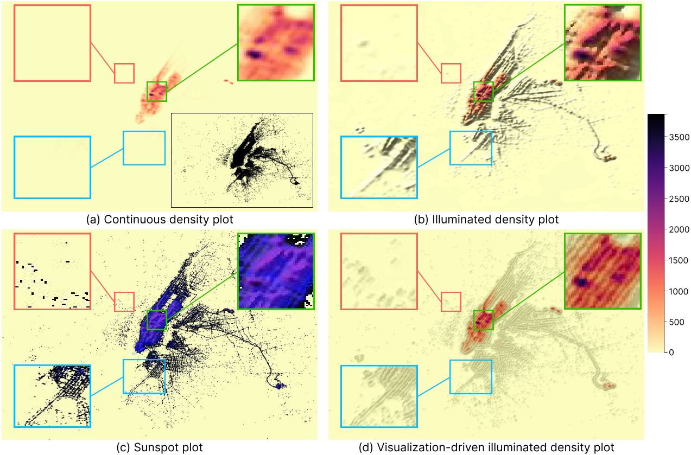

# Visualization-Driven Illumination for Density Plots

An interactive prototype for the technique proposed in our IEEE TVCG submission "Visualization-Driven Illumination for Density Plots".



## Demo

You can try our technique through the online application available at <https://xinchen-sdu.github.io/Visualization-Aware-Illumination-for-Density-Plots/>.

**The format of the input custom dataset should be a CSV file consisting of two columns of numbers without a header.**

## Project Setup

We offer two versions to experience the VIDP technique, you can choose whichever you prefer.

### JavaScript version

We developed this prototype on Ubuntu 20.04 LTS with [Vue 3](https://vueframework.com/), [Element Plus](https://element-plus.org/), [D3.js](https://d3js.org/), and [fast-kde](https://github.com/uwdata/fast-kde).

1. Clone this repository

2. Compile and Hot-Reload for Development

```sh
npm run dev
```

3. Compile and Minify for Production

```sh
npm run build
```

BTW, you can lint the project with [ESLint](https://eslint.org/)

```sh
npm run lint
```

### Python version

We tested our code on Ubuntu 20.04 LTS with Python 3.8.10.

1. Clone this repository

2. Install the following dependencies
```
pip install notebook==6.5.6 numpy==1.21.5 pandas==1.4.3 matplotlib==3.6.3 opencv-contrib-python==4.10.0.82 KDEpy==1.1.8 scikit-learn==1.1.3 pycolormap-2d==1.0.10
```

3. Start jupyter notebook
```
jupyter notebook
```

4. Open illumination.ipynb

## License

This code is licensed under the MIT License. If you use our data or code in your work, please cite our paper:

```
@article{chen2024vidp,
  author={Chen, Xin and Wang, Yunhai and Bao, Huaiwei and Lu, Kecheng and Jo, Jaemin and Fu, Chi-Wing and Fekete, Jean-Daniel},
  journal={IEEE Transactions on Visualization and Computer Graphics}, 
  title={Visualization-Driven Illumination for Density Plots}, 
  year={2024},
  volume={},
  number={},
  pages={1-14},
  keywords={Density plot;illumination;image composition;shading},
  doi={10.1109/TVCG.2024.3495695}
}
```